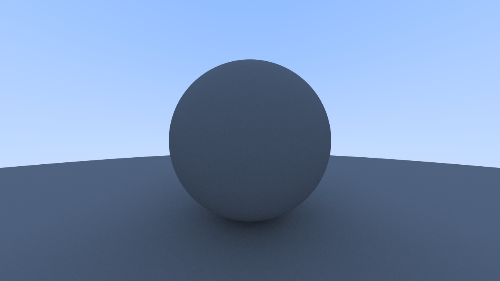
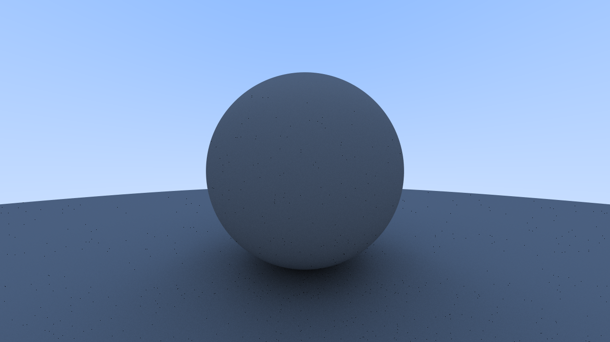
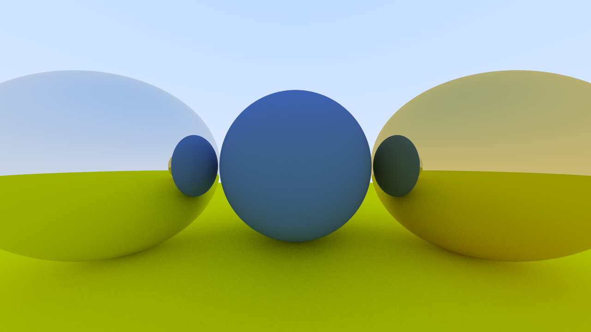
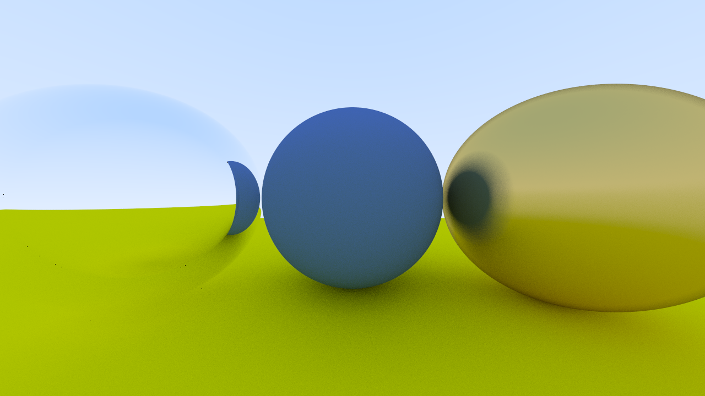

# Ray Tracer

Simple interactive CPU ray tracer being written with C++, later porting to GPU using OpenGL.

## Renders

1. **Sphere**
   
    

2. **Diffuse Sphere**
   
    

3. **Lambertian Sphere**

    

4. **Metal**

    

5. **Dielectric**

    

## Project Setup
1. Generate project files
    - Makefile
        ```bash
        premake5 gmake2
        ```

    - Visual Studio
        ```bash
        premake5 vs2022
        ```